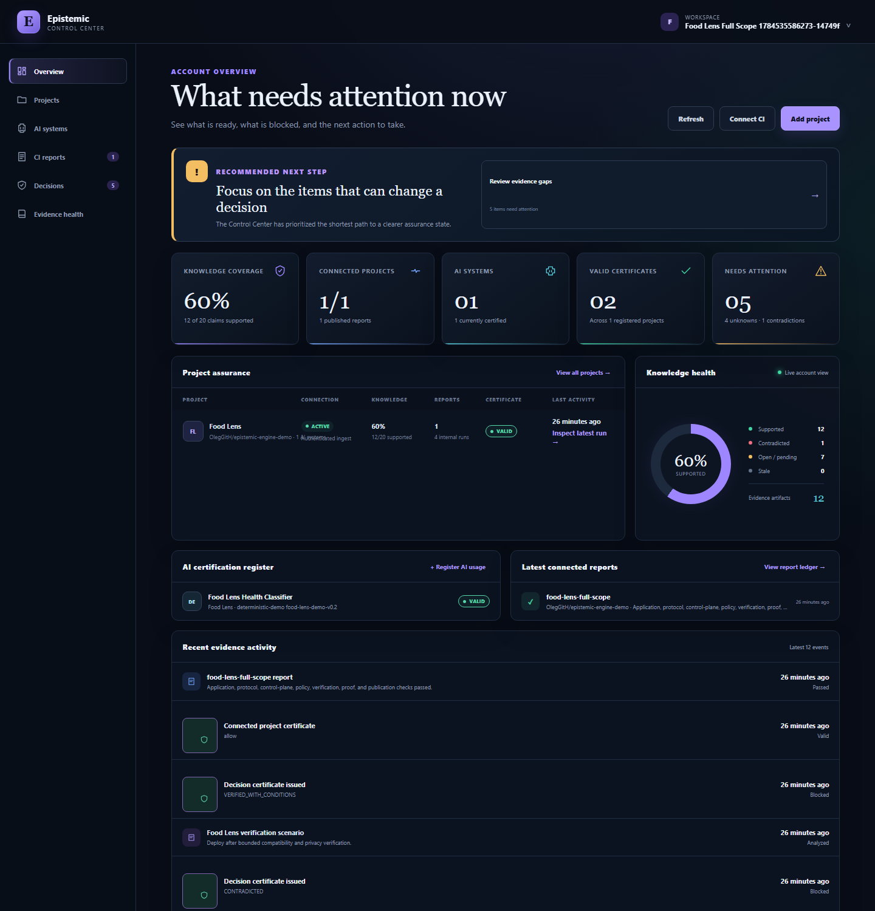
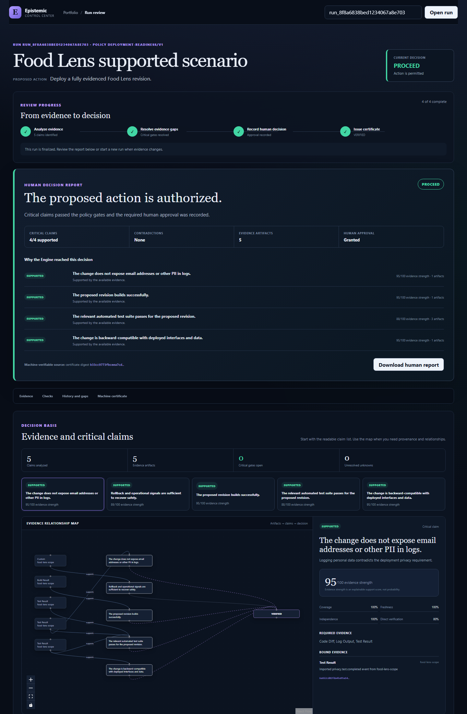

# OpenAI Build Week 2026 submission packet

## Submission identity

- **Project:** Epistemic Engine
- **Category:** Developer Tools
- **Tagline:** Evidence before autonomous action.
- **Repository:** https://github.com/OlegGitH/epistemic-engine
- **Demo repository:** https://github.com/OlegGitH/epistemic-engine-demo
- **Release:** https://github.com/OlegGitH/epistemic-engine/releases/tag/v0.2.0
- **License:** MIT
- **Supported platforms:** Windows, macOS, and Linux with Docker Desktop; the production package targets Google Cloud Run and Cloud SQL.

## Judge promise

In under five minutes, a judge can observe an AI-assisted deployment recommendation move through evidence ingestion, claim analysis, contradiction and unknown detection, bounded verification, deterministic policy, a machine-verifiable certificate, and a plain-English decision report.

The Food Lens repository provides four intentionally different branch outcomes. A blocked outcome is a successful test when the Engine blocks it for the expected epistemic reason.

## Compliance checklist

- [x] Working, non-trivial Developer Tools project
- [x] Public source repository
- [x] MIT license
- [x] Installation and supported-platform instructions
- [x] Sample scenarios and data
- [x] Codex collaboration documented in the main README
- [x] GPT-5.6 Responses API integration implemented
- [x] Official Codex SDK integration implemented
- [x] Dated Build Week commit history
- [x] Local application, protocol, database, dashboard, and branch-matrix tests
- [x] All Engine CI checks green on `main`
- [x] Demo application, full-scope, branch-scenario, and restart-persistence CI green
- [ ] Public Cloud Run dashboard URL
- [ ] Public Cloud Run API health URL
- [ ] Live GPT-5.6 proof artifact captured
- [ ] Live Codex SDK proof artifact captured
- [ ] Public YouTube demo shorter than three minutes
- [ ] Codex `/feedback` session ID
- [ ] Devpost entry saved, reviewed, and submitted

## Five-minute judge path

### Public demo

Add the final Cloud Run URL here after deployment. The instance must remain available without charge or login through the judging period.

### Local fallback

```bash
git clone https://github.com/OlegGitH/epistemic-engine.git
cd epistemic-engine
docker compose up --build
```

1. Open `http://localhost:3000`.
2. In another terminal, run `cd apps/control-plane && go run ./cmd/seed --scenario unsafe`.
3. Open `http://localhost:3000/run` and enter the printed run ID.
4. Review evidence, claims, contradictions, unknowns, policy and the human report.
5. Repeat with `--scenario pending` and `--scenario corrected`.

To exercise the repository pipeline matrix, follow the branch table in the Food Lens [branch scenario lab](https://github.com/OlegGitH/epistemic-engine-demo/blob/main/docs/branch-scenario-lab.md).

## Build Week work and Codex collaboration

The repositories and implementation history were created during the July 13–21, 2026 submission period. Codex was used as a collaborative engineering agent to:

- translate product and architecture decisions into executable modules;
- build protocol schemas, SDKs, adapters and conformance tests;
- implement the Go control plane and PostgreSQL repository;
- build and refine the Next.js decision workspace;
- diagnose CI and persistence failures from concrete logs;
- create the branch-based scenario lab and its assertions;
- package the GCP deployment and judge-facing documentation.

The human retained and made the consequential product decisions: what belongs in the vendor-neutral protocol, what remains deterministic, which actions require approval, how raw image data is bounded, which evidence is critical, and whether to deploy or publish changes.

GPT-5.6 is used at runtime through the Responses API to propose structured claim decompositions. The separate Codex SDK worker may create only a bounded test patch after approval. Neither integration owns authorization or the final policy decision.

## Submission assets





- `assets/control-center.png` — account and project portfolio
- `assets/decision-run.png` — run-level evidence and claim inspection
- `assets/human-certificate.png` — human-readable certificate output
- `assets/full-scope-dashboard.png` — complete scenario aggregation
- `assets/food-lens.png` — demo application
- `devpost-copy.md` — ready-to-paste project description
- `video-script.md` — timed demo script
- `live-proof.md` — credential-safe live GPT-5.6 and Codex proof procedure

## Final owner-only actions

1. Confirm Devpost eligibility, registration, team membership, and representative.
2. Set `OPENAI_API_KEY` locally and run the live proof; never commit the key.
3. Confirm a billing-enabled GCP project before deploying billable Cloud Run and Cloud SQL resources.
4. Record and upload the public YouTube video.
5. Run `/feedback` in the primary Codex project thread and paste the returned session ID into Devpost.
6. Review all public links in a signed-out browser and submit before the deadline.
